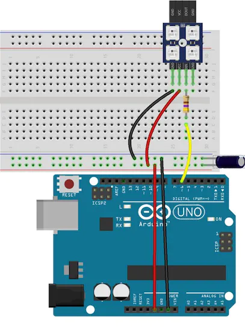
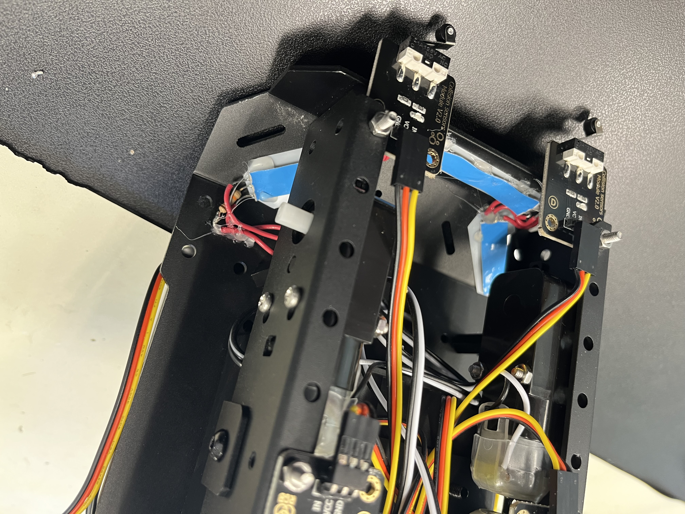
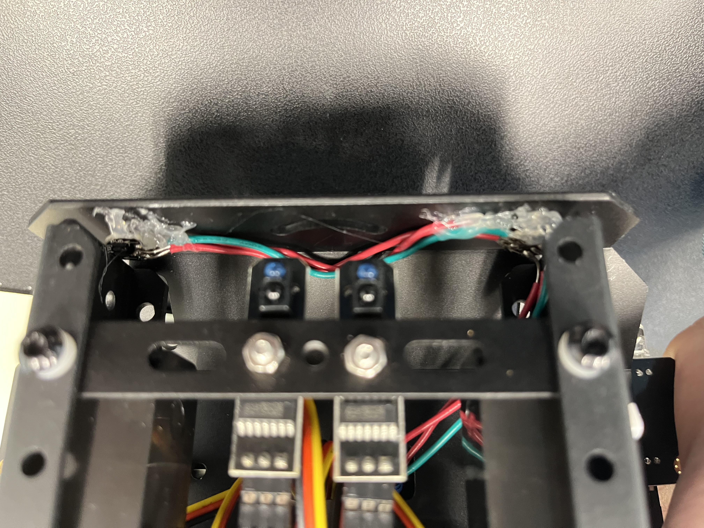
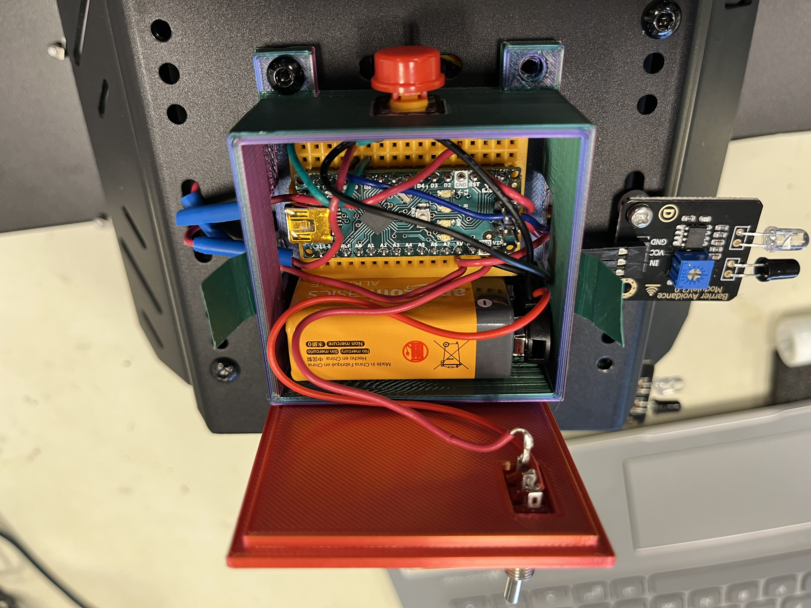

# Omniwheel Robot
The omni wheel robot can not only work like a normal car, but also features unique wheels that have individual wheels on them that allow the robot to shift in different directions based on which individual wheel is spinning. In addition, the robot features a hand gesture mode that can be uses IR infared sensors to detect objects and shift the robot left, right and backwards. The robot also features a bluetooth module which allows it to be connected to a phone, which can be used to remotely control the robot. The robot also features a object avoidance and line following mode, which utilizes its sensors and limit switches.

| **Engineer** | **School** | **Area of Interest** | **Grade** |
|:--:|:--:|:--:|:--:|
| Nathan R | Gunn High School | Electrical Engineering | Incoming Junior

<!--- **Replace the BlueStamp logo below with an image of yourself and your completed project. Follow the guide [here](https://tomcam.github.io/least-github-pages/adding-images-github-pages-site.html) if you need help.**

 -->
  
# Final Milestone

**Don't forget to replace the text below with the embedding for your milestone video. Go to Youtube, click Share -> Embed, and copy and paste the code to replace what's below.**

<iframe width="560" height="315" src="https://www.youtube.com/embed/dQHj8EMfyqo" title="YouTube video player" frameborder="0" allow="accelerometer; autoplay; clipboard-write; encrypted-media; gyroscope; picture-in-picture; web-share" allowfullscreen></iframe>

For your final milestone, explain the outcome of your project. Key details to include are:
- What you've accomplished since your previous milestone
- What your biggest challenges and triumphs were at BSE
- A summary of key topics you learned about
- What you hope to learn in the future after everything you've learned at BSE


# Second Milestone

<iframe width="560" height="315" src="https://www.youtube.com/embed/ZwUDglRnylw" title="YouTube video player" frameborder="0" allow="accelerometer; autoplay; clipboard-write; encrypted-media; gyroscope; picture-in-picture; web-share" allowfullscreen></iframe>

For my second milestone, I mainly worked on setting up and getting my LEDS to work. For the LEDS themselves i used RGB neopixels both individually and in strips. I used the individual LEDS for the front headlights, whereas i used the strips in sections of 2 and 3 for the taillights. What really surprised my was that almost all of the RGB neopixels had the same pins. In order to connect them together, each RGB neopixel has a DIN, 5V, and ground pin, which i used to solder each neopixel together with wires. In the end, I had two pairs of wires, which could not connect directly to one arduino, which only had 1 5V pin, so i used an arduino pro micro connected to a breadboard, which allowed multiple wires to connect to the 5V pin. I then used the FastLED library in order to get the neopixels themselves to work. Personally, i found mounting the LEDS the biggest challenge so far, since it involved precise hotglueing, which was difficult. I then connected a 9V battery to the system, however, the as long as the battery was plugged in, the LEDS would always stay on, so i decided to add a switch to control if the system got current or not. Overall, adding the LEDS was a good way to make my project more unique and personalized. Before my final milestone, I wanted to add a button that cycles between various color modes.


# First Milestone

<!--- **Don't forget to replace the text below with the embedding for your milestone video. Go to Youtube, click Share -> Embed, and copy and paste the code to replace what's below.** -->

<iframe width="560" height="315" src="https://www.youtube.com/embed/0cXjjOHeO9c" title="YouTube video player" frameborder="0" allow="accelerometer; autoplay; clipboard-write; encrypted-media; gyroscope; picture-in-picture; web-share" allowfullscreen></iframe>

For my first milestone, I completed the omni wheel robot as it came out of the box. Throughout the process of building, I learned more about the specific parts and their purposes as well as how each part interacted with each other. For example, while using the object avoidance mode, the IR sensors can detect an object in front of it and as a response, is able to trigger the motors, which spin in a certain way to avoid the obstacle. In comparison, the crash sensors detect whether something is pushing against its button, activating it. I also learned how the robot itself moves. Since the wheels on the robot dont change orientation like a traditional car, each wheel has its own miniature wheels that assist the robot to turn and shift based on which motors are spinning and how fast they are spinning. This means that the robot is able to shift in presice directions and not just left and right. The main challenges i faced was understanding the wiring and how to manage all of it. I overcame this issue by paying attention to the labelled pins on the wire and the board. Despite the robot being a part of a kit, it gave me a good platform to build on in the future, which i plan to add various LEDS as headlights and tailights, which I want to connect and control from a seperate arduino, as well as 3D print various parts such as a cover for the second arduino, which i plan to fit on top of the robot.

# Starter Project

<!---**Don't forget to replace the text below with the embedding for your milestone video. Go to Youtube, click Share -> Embed, and copy and paste the code to replace what's below.**--->

<iframe width="560" height="315" src="https://www.youtube.com/embed/-Aj4a3KioSA" title="YouTube video player" frameborder="0" allow="accelerometer; autoplay; clipboard-write; encrypted-media; gyroscope; picture-in-picture; web-share" allowfullscreen></iframe>

My starter project was a soldering exercise that features 3 sliders that control the red, green, and blue on the LED that is also attatched to the system. The can be connected via USB to a computer to be powered and controlled. A challenge that i faced while building was the polarity of the LED. At the time, I forgot to pay attention to the orientation of the LED, which led to LED colors to be reversed. However, this was a simple fix as it only required some de-soldering.

# Schematics 






# Code
Here's where you'll put your code. The syntax below places it into a block of code. Follow the guide [here]([url](https://www.markdownguide.org/extended-syntax/)) to learn how to customize it to your project needs. 

```c++
/// @file    Blink.ino
/// @brief   Blink the first LED of an LED strip
/// @example Blink.ino

#include <FastLED.h>
#include <ezButton.h>

// How many leds in your strip?
#define NUM_LEDS 7


// For led chips like WS2812, which have a data line, ground, and power, you just
// need to define DATA_PIN.  For led chipsets that are SPI based (four wires - data, clock,
// ground, and power), like the LPD8806 define both DATA_PIN and CLOCK_PIN
// Clock pin only needed for SPI based chipsets when not using hardware SPI
#define DATA_PIN 9
#define CLOCK_PIN 13
ezButton button(8);
// Define the array of leds
CRGB leds[NUM_LEDS];
int mode = 0;
int buttonTime = 0;

void setup() {
  button.setDebounceTime(50);
  // Uncomment/edit one of the following lines for your leds arrangement.
  // ## Clockless types ##
  FastLED.addLeds<NEOPIXEL, DATA_PIN>(leds, NUM_LEDS);  // GRB ordering is assumed
                                                        // FastLED.addLeds<SM16703, DATA_PIN, RGB>(leds, NUM_LEDS);
                                                        // FastLED.addLeds<TM1829, DATA_PIN, RGB>(leds, NUM_LEDS);
                                                        // FastLED.addLeds<TM1812, DATA_PIN, RGB>(leds, NUM_LEDS);
                                                        // FastLED.addLeds<TM1809, DATA_PIN, RGB>(leds, NUM_LEDS);
                                                        // FastLED.addLeds<TM1804, DATA_PIN, RGB>(leds, NUM_LEDS);
                                                        // FastLED.addLeds<TM1803, DATA_PIN, RGB>(leds, NUM_LEDS);
                                                        // FastLED.addLeds<UCS1903, DATA_PIN, RGB>(leds, NUM_LEDS);
                                                        // FastLED.addLeds<UCS1903B, DATA_PIN, RGB>(leds, NUM_LEDS);
                                                        // FastLED.addLeds<UCS1904, DATA_PIN, RGB>(leds, NUM_LEDS);
                                                        // FastLED.addLeds<UCS2903, DATA_PIN, RGB>(leds, NUM_LEDS);
                                                        // FastLED.addLeds<WS2812, DATA_PIN, RGB>(leds, NUM_LEDS);  // GRB ordering is typical
                                                        // FastLED.addLeds<WS2852, DATA_PIN, RGB>(leds, NUM_LEDS);  // GRB ordering is typical
                                                        // FastLED.addLeds<WS2812B, DATA_PIN, RGB>(leds, NUM_LEDS);  // GRB ordering is typical
                                                        // FastLED.addLeds<GS1903, DATA_PIN, RGB>(leds, NUM_LEDS);
                                                        // FastLED.addLeds<SK6812, DATA_PIN, RGB>(leds, NUM_LEDS);  // GRB ordering is typical
                                                        // FastLED.addLeds<SK6822, DATA_PIN, RGB>(leds, NUM_LEDS);
                                                        // FastLED.addLeds<APA106, DATA_PIN, RGB>(leds, NUM_LEDS);
                                                        // FastLED.addLeds<PL9823, DATA_PIN, RGB>(leds, NUM_LEDS);
                                                        // FastLED.addLeds<SK6822, DATA_PIN, RGB>(leds, NUM_LEDS);
                                                        // FastLED.addLeds<WS2811, DATA_PIN, RGB>(leds, NUM_LEDS);
                                                        // FastLED.addLeds<WS2813, DATA_PIN, RGB>(leds, NUM_LEDS);
                                                        // FastLED.addLeds<APA104, DATA_PIN, RGB>(leds, NUM_LEDS);
                                                        // FastLED.addLeds<WS2811_400, DATA_PIN, RGB>(leds, NUM_LEDS);
                                                        // FastLED.addLeds<GE8822, DATA_PIN, RGB>(leds, NUM_LEDS);
                                                        // FastLED.addLeds<GW6205, DATA_PIN, RGB>(leds, NUM_LEDS);
                                                        // FastLED.addLeds<GW6205_400, DATA_PIN, RGB>(leds, NUM_LEDS);
                                                        // FastLED.addLeds<LPD1886, DATA_PIN, RGB>(leds, NUM_LEDS);
                                                        // FastLED.addLeds<LPD1886_8BIT, DATA_PIN, RGB>(leds, NUM_LEDS);
                                                        // ## Clocked (SPI) types ##
                                                        // FastLED.addLeds<LPD6803, DATA_PIN, CLOCK_PIN, RGB>(leds, NUM_LEDS);  // GRB ordering is typical
                                                        // FastLED.addLeds<LPD8806, DATA_PIN, CLOCK_PIN, RGB>(leds, NUM_LEDS);  // GRB ordering is typical
                                                        // FastLED.addLeds<WS2801, DATA_PIN, CLOCK_PIN, RGB>(leds, NUM_LEDS);
                                                        // FastLED.addLeds<WS2803, DATA_PIN, CLOCK_PIN, RGB>(leds, NUM_LEDS);
                                                        // FastLED.addLeds<SM16716, DATA_PIN, CLOCK_PIN, RGB>(leds, NUM_LEDS);
                                                        // FastLED.addLeds<P9813, DATA_PIN, CLOCK_PIN, RGB>(leds, NUM_LEDS);  // BGR ordering is typical
                                                        // FastLED.addLeds<DOTSTAR, DATA_PIN, CLOCK_PIN, RGB>(leds, NUM_LEDS);  // BGR ordering is typical
                                                        // FastLED.addLeds<APA102, DATA_PIN, CLOCK_PIN, RGB>(leds, NUM_LEDS);  // BGR ordering is typical
                                                        // FastLED.addLeds<SK9822, DATA_PIN, CLOCK_PIN, RGB>(leds, NUM_LEDS);  // BGR ordering is typical
}

void loop() {
  button.loop();  // MUST call the loop() function first

  if (buttonTime+2000 < millis() && button.isPressed()) {
    Serial.println("The button is pressed");
    buttonTime = millis();
    if (mode == 2) {
      mode = 0;
    } else {
      mode = mode + 1;
    }
  }
  if (mode == 0) {
    // Turn the LED on, then pause
    leds[0] = CRGB::Red;
    leds[1] = CRGB::Red;
    leds[2] = CRGB::Red;
    leds[3] = CRGB::Red;
    leds[4] = CRGB::Red;
    leds[5] = CRGB::Red;
    leds[6] = CRGB::Red;
    FastLED.show();
    delay(100);
    // Now turn the LED off, then pause
    leds[0] = CRGB::Black;
    leds[1] = CRGB::Black;
    leds[2] = CRGB::Black;
    leds[3] = CRGB::Black;
    leds[4] = CRGB::Black;
    leds[5] = CRGB::Black;
    leds[6] = CRGB::Black;
    FastLED.show();
    delay(100);

    leds[0] = CRGB::Red;
    leds[1] = CRGB::Red;
    leds[2] = CRGB::Red;
    leds[3] = CRGB::Red;
    leds[4] = CRGB::Red;
    leds[5] = CRGB::Red;
    leds[6] = CRGB::Red;
    FastLED.show();
    delay(200);

    leds[0] = CRGB::Black;
    leds[1] = CRGB::Black;
    leds[2] = CRGB::Black;
    leds[3] = CRGB::Black;
    leds[4] = CRGB::Black;
    leds[5] = CRGB::Black;
    leds[6] = CRGB::Black;
    FastLED.show();
    delay(500);
  } else if (mode == 1) {
    // Turn the LED on, then pause
    leds[0] = CRGB::Blue;
    leds[1] = CRGB::Blue;
    leds[2] = CRGB::Blue;
    leds[3] = CRGB::Red;
    leds[4] = CRGB::Red;
    leds[5] = CRGB::Red;
    leds[6] = CRGB::Red;
    FastLED.show();
    delay(250);
    // Now turn the LED off, then pause
    leds[0] = CRGB::Red;
    leds[1] = CRGB::Red;
    leds[2] = CRGB::Red;
    leds[3] = CRGB::Red;
    leds[4] = CRGB::Blue;
    leds[5] = CRGB::Blue;
    leds[6] = CRGB::Blue;
    FastLED.show();
    delay(250);
  } else if (mode == 2) {
    leds[0].red   = 500;
    leds[0].green = 0;
    leds[0].blue  = 0;
    FastLED.show();
    delay(100);
    leds[1].red   = 500;
    leds[1].green = 300;
    leds[1].blue  = 0;
    FastLED.show();
    delay(100);
    leds[2].red   = 500;
    leds[2].green = 450;
    leds[2].blue  = 0;
    FastLED.show();
    delay(100);
    leds[3] = CRGB::Green;
    FastLED.show();
    delay(100);
    leds[4] = CRGB::Blue;
    FastLED.show();
    delay(100);
    leds[5] = CRGB::Purple;
    FastLED.show();
    delay(100);
    leds[6] = CRGB::White;
    FastLED.show();
    delay(100);
    FastLED.show();
    leds[0] = CRGB::Black;
    FastLED.show();
    delay(100);
    leds[1] = CRGB::Black;
    FastLED.show();
    delay(100);
    leds[2] = CRGB::Black;
    FastLED.show();
    delay(100);
    leds[3] = CRGB::Black;
    FastLED.show();
    delay(100);
    leds[4] = CRGB::Black;
    FastLED.show();
    delay(100);
    leds[5] = CRGB::Black;
    FastLED.show();
    delay(100);
    leds[6] = CRGB::Black;
    FastLED.show();
    delay(100);
  }
}

```

# Bill of Materials
Here's where you'll list the parts in your project. To add more rows, just copy and paste the example rows below.
Don't forget to place the link of where to buy each component inside the quotation marks in the corresponding row after href =. Follow the guide [here]([url](https://www.markdownguide.org/extended-syntax/)) to learn how to customize this to your project needs. 

| **Part** | **Note** | **Price** | **Link** |
|:--:|:--:|:--:|:--:|
| Neopixel LED strip | Taillights | 30$ | <a href="[https://www.amazon.com/Arduino-A000066-ARDUINO-UNO-R3/dp/B008GRTSV6/](https://www.amazon.com/BTF-LIGHTING-Upgraded-Individually-Addressable-Non-Waterproof/dp/B07LG5S6DK/ref=sxin_16_pa_sp_search_thematic_sspa?content-id=amzn1.sym.1c86ab1a-a73c-4131-85f1-15bd92ae152d%3Aamzn1.sym.1c86ab1a-a73c-4131-85f1-15bd92ae152d&crid=1MLU7C071BZ5F&cv_ct_cx=neopixel&keywords=neopixel&pd_rd_i=B07LG5S6DK&pd_rd_r=af5a025e-7e2a-4bf4-aa13-c03350394920&pd_rd_w=CM7Hs&pd_rd_wg=qweHi&pf_rd_p=1c86ab1a-a73c-4131-85f1-15bd92ae152d&pf_rd_r=PCYQBW6EA01ZRQVF7RJR&qid=1689873653&sbo=RZvfv%2F%2FHxDF%2BO5021pAnSA%3D%3D&sprefix=neopixel%2Caps%2C246&sr=1-2-364cf978-ce2a-480a-9bb0-bdb96faa0f61-spons&sp_csd=d2lkZ2V0TmFtZT1zcF9zZWFyY2hfdGhlbWF0aWM&psc=1)"> Link </a> |
| Neopixel grid | Headlights | 15$ | <a href="[https://www.amazon.com/Arduino-A000066-ARDUINO-UNO-R3/dp/B008GRTSV6/](https://www.amazon.com/ALITOVE-100pcs-WS2812B-Addressable-Arduino/dp/B01D1FFVOA/ref=sr_1_6?crid=3CQ2U3PFY2GFP&keywords=neopixel+grid&qid=1689873784&sprefix=neopixel+grid%2Caps%2C137&sr=8-6)"> Link </a> |
| plastic sheet | Taillights | 10$ | <a href="[https://www.amazon.com/Arduino-A000066-ARDUINO-UNO-R3/dp/B008GRTSV6/](https://www.amazon.com/Translucent-Stencil-Gyro-Cut-Template-Material/dp/B08PVYHH4M/ref=sr_1_5?crid=2VVXAIK48Q23F&keywords=opaque+plastic+sheet&qid=1689873944&sprefix=opaque+plastic+sheet%2Caps%2C123&sr=8-5)"> Link </a> |

<!--- # Other Resources/Examples
One of the best parts about Github is that you can view how other people set up their own work. Here are some past BSE portfolios that are awesome examples. You can view how they set up their portfolio, and you can view their index.md files to understand how they implemented different portfolio components.
- [Example 1](https://trashytuber.github.io/YimingJiaBlueStamp/)
- [Example 2](https://sviatil0.github.io/Sviatoslav_BSE/)
- [Example 3](https://arneshkumar.github.io/arneshbluestamp/)

To watch the BSE tutorial on how to create a portfolio, click here.-->
